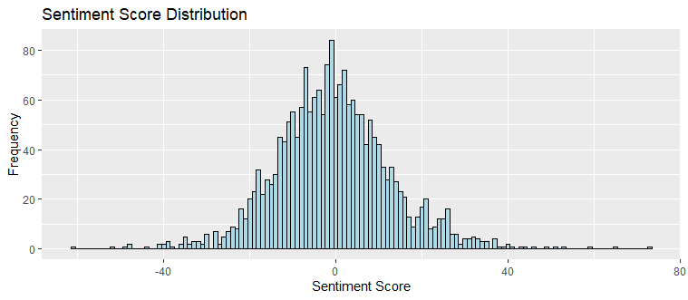

# 🎥 Movie Review Sentiment Analysis 📈🧠

Welcome to the **Movie Review Sentiment Analysis** project! In this project, we analyze a collection of movie reviews using Natural Language Processing (NLP) in **R** to extract sentiment insights. We utilize the **Bing Lexicon** to classify words as positive or negative, then compute a sentiment score for each review.


---

## 🚀 Project Overview

We used a dataset of movie reviews (stored in an Excel file) and performed:

- ✅ Data Loading with `readxl`
- ✅ Text Tokenization using `tidytext`
- ✅ Sentiment Mapping using the **Bing Lexicon**
- ✅ Sentiment Score Computation per Review
- ✅ Visualizations (Histogram of Sentiment Scores)

---

## 🧰 Technologies Used

- **R 4.x**
- **tidyverse** – Data manipulation and plotting
- **tidytext** – Text tokenization and sentiment analysis
- **readxl** – Excel data import
- **ggplot2** – Visualizations

---

## 📁 Dataset Source

The dataset consists of movie reviews in Excel format:

📎 [`movie_review.xlsx`](data/movie_review.xlsx)

Each row contains:
- `fold_id`: Cross-validation fold ID
- `cv_tag`: Review tag
- `html_id`: Unique identifier
- `text`: Review content

---

## 🔍 Key Highlights

### 📌 Word Tokenization

We broke down the full text of reviews into individual words using `unnest_tokens()` to enable word-level sentiment analysis.

---

### 😀 Sentiment Analysis with Bing Lexicon

We matched words with the **Bing Lexicon**, which labels them as either *positive* or *negative*. For each review, we computed:


---

### 📊 Sentiment Score Distribution

Visualized using `ggplot2`:



> Most reviews fall near zero (neutral), with a few strongly positive or negative.

---

## 🧪 How to Run

1. Clone the repository:
   ```bash
   git clone https://github.com/MK3685/movie-review-sentiment.git
   cd movie-review-sentiment
